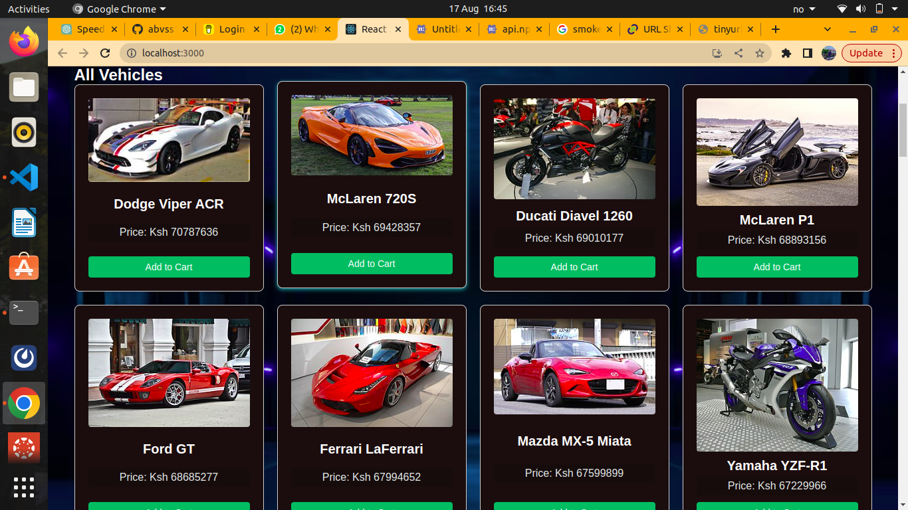

# Abvss Dealership

Abvss Dealership is a React web application that allows users to browse and purchase vehicles from a virtual dealership. Users can view a list of available cars and motorbikes, sort and filter them, add them to their cart, and view their cart contents. Additionally, users can contact the dealer for inquiries.

## Features

- Browse and search for vehicles.
- Sort vehicles by price and name.
- Filter vehicles by type (cars or motorbikes).
- Add vehicles to the cart and remove them.
- View the total number of items in the cart.
- Contact the dealer for inquiries.

## Technologies Used

- React: JavaScript library for building user interfaces.
- Axios: Promise-based HTTP client for making API requests.
- CSS: Styling and layout of the application.

## Getting Started

To get started with the Abvss Dealership application, follow these steps:

1. Clone the repository:

   
   `git clone https://github.com/abvss13/abvss-dealership.git`

## Usage

Use the search bar to find specific vehicles by name.
Sort the list of vehicles by price or name using the dropdown menu.
Filter the list by selecting "All," "Cars," or "Motorbikes."
Click the "Add to Cart" button to add a vehicle to your cart.
Click the "View Cart" button to see the items in your cart.
In the cart, you can remove items or close the cart modal.
Click the "Dealer Contact" button to view contact information for inquiries.
Contributing
Contributions are welcome! If you have any enhancements or bug fixes, feel free to open a pull request. Please make sure to follow the code style and submit detailed information about your changes.

## License

This project is licensed under the MIT License - see the LICENSE file for details.